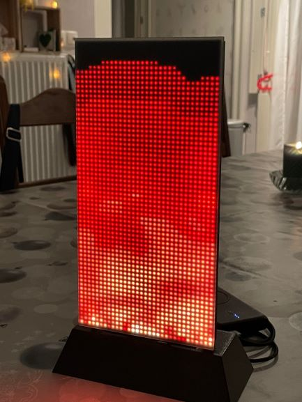

# Fire
 
Pieced together from samples from Adafruit's ProtoMatter library and some code I found [here](https://lodev.org/cgtutor/fire.html), created this fire effect display on a [Matrix Portal Starter Kit](https://www.adafruit.com/product/4812).

Kept playing with it until I got the randomisation effect that I wanted. 

